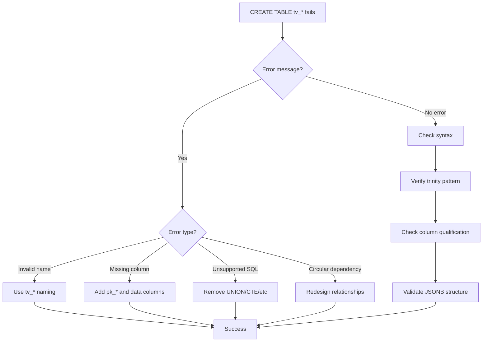
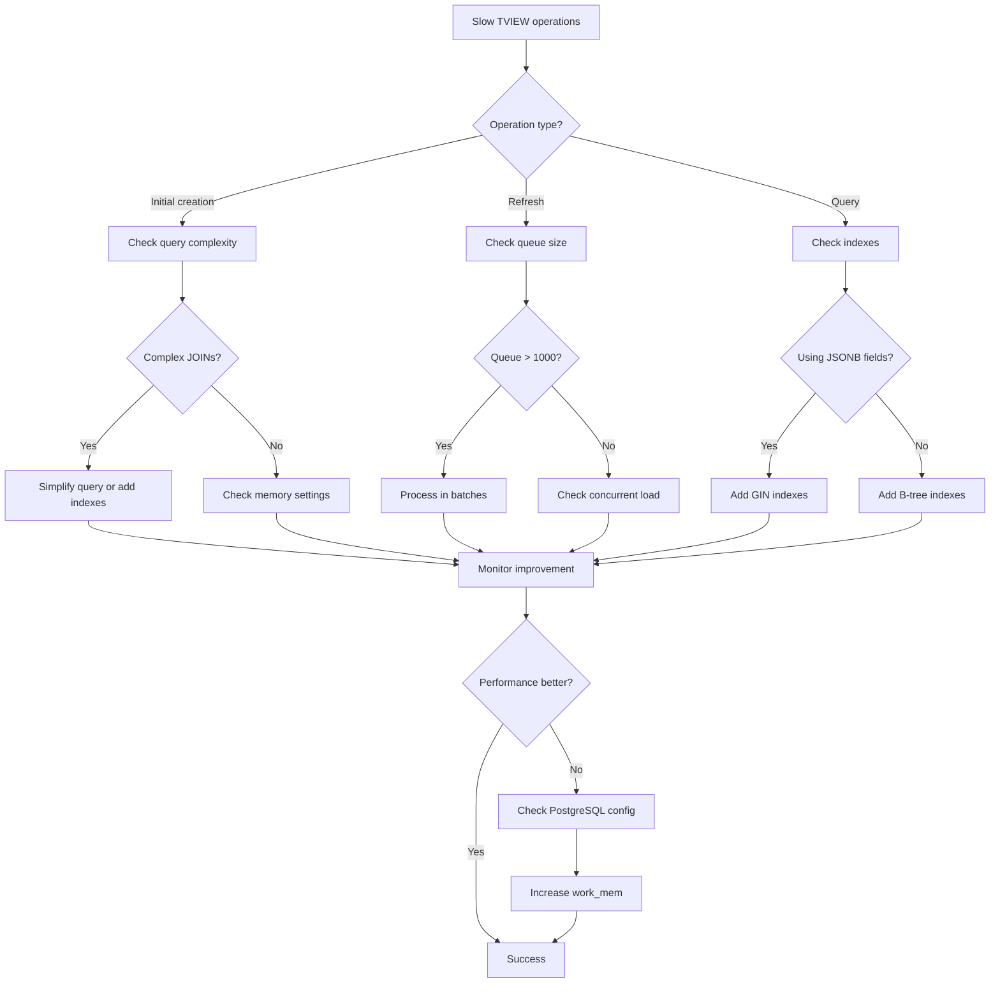
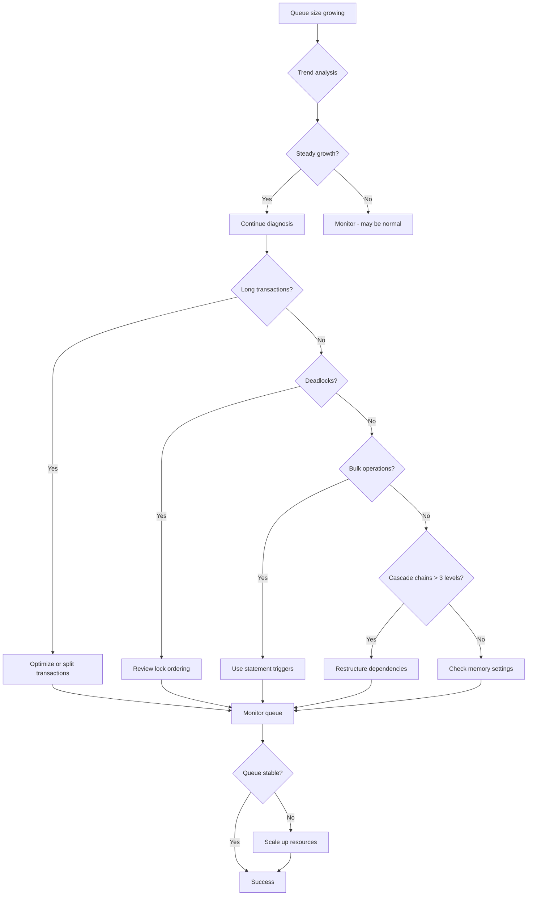
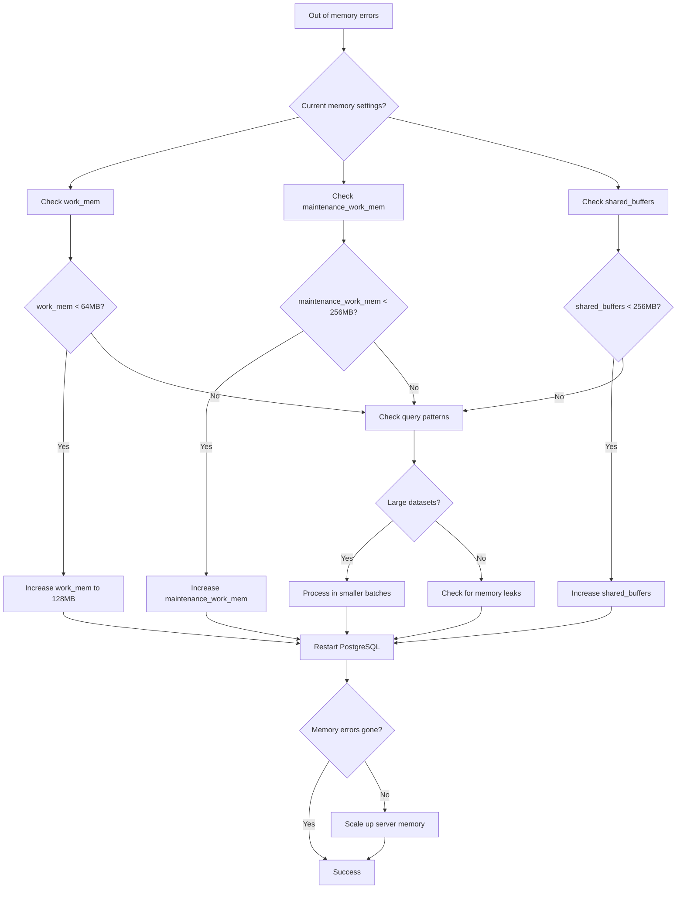

# Troubleshooting Guide

Common issues and solutions for pg_tviews deployment and operation.

**Version**: 0.1.0-beta.1 • **Last Updated**: December 11, 2025

## Quick Diagnosis

### Health Check

Run this first for any issue:

```sql
-- Basic health check
SELECT * FROM pg_tviews_health_check();

-- Check for errors
SELECT * FROM pg_tviews_health_check()
WHERE status IN ('ERROR', 'WARNING');
```

### Queue Status

Check refresh queue status:

```sql
-- Current queue state
SELECT pg_tviews_queue_stats();

-- Queue contents (for debugging)
SELECT pg_tviews_debug_queue();
```

## Installation Issues

### Extension Not Found

**Error**: `ERROR: extension "pg_tviews" does not exist`

**Solutions**:

1. **Check if extension is installed**:
   ```bash
   # List installed extensions
   psql -d your_db -c "\dx pg_tviews"

   # Check extension files exist
   find /usr -name "*pg_tviews*" 2>/dev/null
   ```

2. **Reinstall extension**:
   ```bash
   # Rebuild and reinstall
   cd pg_tviews
   cargo pgrx install --release

   # Create extension
   psql -d your_db -c "CREATE EXTENSION pg_tviews;"
   ```

3. **Check PostgreSQL version compatibility**:
   ```sql
   SELECT version();
   -- Must be PostgreSQL 15+
   ```

### Permission Denied

**Error**: `ERROR: permission denied for function pg_tviews_version()`

**Solutions**:

1. **Check user permissions**:
   ```sql
   SELECT current_user;
   SELECT rolname, rolsuper FROM pg_roles WHERE rolname = current_user;
   ```

2. **Grant necessary permissions**:
   ```sql
   -- As superuser
   GRANT USAGE ON SCHEMA public TO your_user;
   GRANT EXECUTE ON ALL FUNCTIONS IN SCHEMA public TO your_user;
   ```

3. **Use superuser for installation**:
   ```sql
   -- Connect as superuser or run:
   -- sudo -u postgres psql -d your_db -c "CREATE EXTENSION pg_tviews;"
   ```

## TVIEW Creation Issues

### Invalid TVIEW Name

**Error**: `ERROR: TVIEW name must follow tv_* convention`

**Solution**: Use correct naming:
```sql
-- Correct
CREATE TABLE tv_post AS SELECT ...;
CREATE TABLE tv_user_profiles AS SELECT ...;

-- Incorrect
CREATE TABLE posts AS SELECT ...;        -- Missing tv_ prefix
CREATE TABLE my_posts AS SELECT ...;     -- Wrong prefix
```

### Missing Required Columns

**Error**: `ERROR: Missing required column: pk_post`

**Solutions**:

1. **Add primary key column**:
   ```sql
   CREATE TABLE tv_post AS
   SELECT
       tb_post.pk_post as pk_post,  -- Required: lineage root
       tb_post.id,                  -- Optional: GraphQL ID
       jsonb_build_object('id', tb_post.id, 'title', tb_post.title) as data
   FROM tb_post;
   ```

2. **Check column naming**: Must be `pk_<entity>` exactly matching TVIEW name

### Missing JSONB Data Column

**Error**: `ERROR: Missing required column: data`

**Solution**: Add JSONB data column:
```sql
CREATE TABLE tv_post AS
SELECT
    tb_post.pk_post as pk_post,
    jsonb_build_object(
        'id', tb_post.id,
        'title', tb_post.title,
        'content', tb_post.content
    ) as data  -- Required: must be named 'data' and be JSONB
FROM tb_post;
```

### Unsupported SQL Features

**Error**: `ERROR: Unsupported SQL feature: UNION`

**Solutions**:

1. **Rewrite without UNION**:
   ```sql
   -- Instead of UNION
   CREATE TABLE tv_content AS
   SELECT 'post' as type, pk_post as pk_content, id, title as name, data FROM tv_post
   UNION
   SELECT 'page' as type, pk_page as pk_content, id, title as name, data FROM tv_page;

   -- Use separate TVIEWs
   CREATE TABLE tv_post AS SELECT ... FROM tb_post;
   CREATE TABLE tv_pages AS SELECT ... FROM tb_page;
   ```

2. **Common unsupported features**:
   - UNION, INTERSECT, EXCEPT
   - WITH (CTEs)
   - Window functions
   - Self-joins (may cause cycles)

### Dependency Cycle Detected

**Error**: `ERROR: Dependency cycle detected: post -> comment -> post`

**Solutions**:

1. **Restructure dependencies**:
   ```sql
   -- Problem: circular reference
   -- post references comment, comment references post

   -- Solution: Make one direction optional or computed
   CREATE TABLE tv_post AS
   SELECT
       p.pk_post,
       jsonb_build_object(
           'id', p.id,
           'title', p.title,
           'commentCount', (SELECT COUNT(*) FROM tb_comment c WHERE c.fk_post = p.pk_post)
       ) as data
   FROM tb_post p;
   -- No direct reference to tv_comment
   ```

2. **Use computed fields instead of JOINs** for circular relationships

## Runtime Issues

### TVIEW Not Updating

**Symptoms**: Changes to base tables don't appear in TVIEWs

**Diagnosis**:

1. **Check triggers exist**:
   ```sql
   SELECT tgname, tgtype, tgenabled
   FROM pg_trigger
   WHERE tgname LIKE 'tview%';
   ```

2. **Check trigger functions**:
   ```sql
   SELECT proname FROM pg_proc WHERE proname LIKE 'tview%';
   ```

3. **Test trigger manually**:
   ```sql
   -- Insert test data
   INSERT INTO tb_post (id, title, fk_user)
   VALUES ('test-uuid', 'Test Post', 1);

   -- Check if TVIEW updated
   SELECT * FROM tv_post WHERE id = 'test-uuid';
   ```

**Solutions**:

1. **Recreate TVIEW**:
   ```sql
   DROP TABLE tv_post;
   CREATE TABLE tv_post AS SELECT ...;  -- Original definition
   ```

2. **Check for disabled triggers**:
   ```sql
   -- Enable triggers
   ALTER TABLE tb_post ENABLE TRIGGER ALL;
   ```

3. **Verify TVIEW registration**:
   ```sql
   SELECT * FROM pg_tview_meta WHERE entity = 'post';
   ```

### Slow Performance

**Symptoms**: TVIEW refreshes are slow (>1 second)

**Diagnosis**:

1. **Check queue timing**:
   ```sql
   SELECT pg_tviews_queue_stats();
   -- Look at total_timing_ms
   ```

2. **Check cascade depth**:
   ```sql
   SELECT pg_tviews_debug_queue();
   -- Many items = deep cascade
   ```

3. **Check system resources**:
   ```sql
   SELECT * FROM pg_stat_activity WHERE state = 'active';
   ```

**Solutions**:

1. **Enable statement-level triggers**:
   ```sql
   SELECT pg_tviews_install_stmt_triggers();
   ```

2. **Add indexes on TVIEWs**:
   ```sql
   CREATE INDEX idx_tv_post_user_id ON tv_post(user_id);
   CREATE INDEX idx_tv_post_id ON tv_post(id);
   ```

3. **Optimize TVIEW definition**:
   ```sql
   -- Avoid expensive operations in TVIEW
   -- Pre-compute aggregations in application if needed
   ```

### Memory Issues

**Symptoms**: Out of memory errors, high memory usage

**Diagnosis**:

1. **Check PostgreSQL memory settings**:
   ```sql
   SHOW shared_buffers;
   SHOW work_mem;
   SHOW maintenance_work_mem;
   ```

2. **Check for large JSONB objects**:
   ```sql
   SELECT id, pg_column_size(data) as size_bytes
   FROM tv_post
   ORDER BY size_bytes DESC
   LIMIT 10;
   ```

**Solutions**:

1. **Increase memory settings**:
   ```sql
   ALTER SYSTEM SET work_mem = '128MB';
   ALTER SYSTEM SET maintenance_work_mem = '512MB';
   ```

2. **Reduce JSONB size**:
   ```sql
   -- Move large fields to separate tables
   -- Use compression for large text fields
   -- Implement pagination for large arrays
   ```

### Lock Conflicts

**Symptoms**: Deadlock errors, slow updates

**Diagnosis**:

1. **Check for locks**:
   ```sql
   SELECT locktype, mode, granted, relation::regclass
   FROM pg_locks
   WHERE relation::regclass::text LIKE 'tv_%';
   ```

2. **Check lock waits**:
   ```sql
   SELECT * FROM pg_stat_activity
   WHERE wait_event_type = 'Lock';
   ```

**Solutions**:

1. **Use shorter transactions**:
   ```sql
   -- Instead of long transactions
   BEGIN;
   -- Many operations
   COMMIT;

   -- Use multiple short transactions
   ```

2. **Implement retry logic** in application

3. **Check for lock contention on TVIEWs**:
   ```sql
   -- TVIEWs are read-mostly, but updates can conflict
   -- Consider application-level optimistic locking
   ```

## Data Consistency Issues

### Count Mismatches

**Symptoms**: TVIEW and base table have different row counts

**Diagnosis**:

```sql
-- Compare counts
SELECT 'tv_post' as table, COUNT(*) FROM tv_post
UNION ALL
SELECT 'tb_post', COUNT(*) FROM tb_post;
```

**Solutions**:

1. **Manual refresh**:
   ```sql
   -- Force complete refresh
   TRUNCATE tv_post;
   INSERT INTO tv_post SELECT * FROM v_post;
   ```

2. **Check for failed operations**:
   ```sql
   SELECT * FROM pg_tviews_health_check();
   ```

### Data Corruption

**Symptoms**: TVIEW data doesn't match base table data

**Diagnosis**:

```sql
-- Spot check data
SELECT
    p.id,
    p.title as base_title,
    (tv.data->>'title') as tview_title,
    p.title = (tv.data->>'title') as matches
FROM tb_post p
LEFT JOIN tv_post tv ON p.id = tv.id
WHERE p.id = 'some-uuid';
```

**Solutions**:

1. **Recreate TVIEW**:
   ```sql
   DROP TABLE tv_post;
   CREATE TABLE tv_post AS SELECT ...;
   ```

2. **Manual data repair**:
   ```sql
   -- Update specific records
   UPDATE tv_post SET data = data || '{"title": "Correct Title"}'::jsonb
   WHERE id = 'problematic-id';
   ```

## Connection Pooling Issues

### PgBouncer Problems

**Symptoms**: Connection issues with PgBouncer

**Solutions**:

1. **Configure server_reset_query**:
   ```ini
   # pgbouncer.ini
   server_reset_query = DISCARD ALL
   ```

2. **Use transaction mode**:
   ```ini
   pool_mode = transaction
   ```

### Connection State Issues

**Symptoms**: TVIEW state not reset between connections

**Diagnosis**:

```sql
-- Check connection state
SELECT pg_tviews_debug_queue();
-- Should be empty for new connections
```

**Solutions**:

1. **Ensure DISCARD ALL** is configured in connection pooler

2. **Check application connection handling**:
   ```javascript
   // Ensure connections are properly reset
   await pool.query('DISCARD ALL');
   ```

## Performance Tuning Issues

### Low Cache Hit Rates

**Symptoms**: Cache hit rate < 80%

**Diagnosis**:

```sql
SELECT pg_tviews_queue_stats();
-- Check graph_cache_hit_rate and table_cache_hit_rate
```

**Solutions**:

1. **Increase shared_buffers**:
   ```sql
   ALTER SYSTEM SET shared_buffers = '2GB';
   ```

2. **Reduce entity count** (if possible)

3. **Optimize TVIEW dependencies**

### High Cascade Depth

**Symptoms**: Deep cascades causing performance issues

**Diagnosis**:

```sql
SELECT pg_tviews_debug_queue();
-- Many items indicate deep cascades
```

**Solutions**:

1. **Restructure dependencies**:
   ```sql
   -- Instead of: user -> post -> comment -> reply
   -- Use: user -> post, comment -> reply (separate chains)
   ```

2. **Use computed fields** instead of JOINs for deep relationships

## Application Integration Issues

### GraphQL Query Performance

**Symptoms**: Slow GraphQL queries despite TVIEWs

**Diagnosis**:

```sql
-- Check query execution
EXPLAIN ANALYZE
SELECT data FROM tv_post WHERE id = 'uuid';

-- Check indexes
SELECT * FROM pg_indexes WHERE tablename = 'tv_post';
```

**Solutions**:

1. **Add proper indexes**:
   ```sql
   CREATE INDEX idx_tv_post_id ON tv_post(id);
   CREATE INDEX idx_tv_post_user_id ON tv_post(user_id);
   CREATE INDEX idx_tv_post_created_at ON tv_post USING gin((data->'createdAt'));
   ```

2. **Optimize query patterns**:
   ```sql
   -- Instead of JSONB queries
   SELECT data FROM tv_post WHERE data->>'title' ILIKE '%search%';

   -- Use separate indexed columns or full-text search
   ```

### Transaction Issues

**Symptoms**: TVIEW updates not visible in same transaction

**Diagnosis**:

```sql
-- Test transaction behavior
BEGIN;
INSERT INTO tb_post (id, title, fk_user) VALUES ('test', 'Test', 1);
SELECT * FROM tv_post WHERE id = 'test';  -- Should work
ROLLBACK;
```

**Solutions**:

1. **TVIEWs are transactionally consistent** - this is expected behavior

2. **For read-after-write** in same transaction, TVIEWs work correctly

3. **For cross-transaction consistency**, use application-level caching if needed

## Advanced Troubleshooting

### Debug Logging

Enable detailed logging:

```sql
-- Enable debug logging
ALTER SYSTEM SET log_min_messages = 'debug1';
ALTER SYSTEM SET log_statement = 'all';

-- Check PostgreSQL logs
tail -f /var/log/postgresql/postgresql-*.log
```

### Performance Profiling

Profile TVIEW operations:

```sql
-- Create profiling function
CREATE OR REPLACE FUNCTION profile_tview_operation(
    operation text,
    entity text,
    pk_value bigint
) RETURNS jsonb AS $$
DECLARE
    start_time timestamptz;
    end_time timestamptz;
    queue_before jsonb;
    queue_after jsonb;
BEGIN
    start_time := clock_timestamp();
    queue_before := pg_tviews_queue_stats();

    -- Execute operation
    CASE operation
        WHEN 'insert' THEN
            PERFORM pg_tviews_insert(entity::regclass::oid, pk_value);
        WHEN 'update' THEN
            PERFORM pg_tviews_cascade(entity::regclass::oid, pk_value);
        WHEN 'delete' THEN
            PERFORM pg_tviews_delete(entity::regclass::oid, pk_value);
    END CASE;

    end_time := clock_timestamp();
    queue_after := pg_tviews_queue_stats();

    RETURN jsonb_build_object(
        'duration_ms', EXTRACT(epoch FROM (end_time - start_time)) * 1000,
        'queue_before', queue_before,
        'queue_after', queue_after
    );
END;
$$ LANGUAGE plpgsql;
```

### Emergency Procedures

#### Complete TVIEW Recreation

For severe issues:

```sql
-- Drop all TVIEWs
DO $$
DECLARE
    rec record;
BEGIN
    FOR rec IN SELECT entity FROM pg_tview_meta LOOP
        EXECUTE 'DROP TABLE tv_' || rec.entity;
    END LOOP;
END;
$$;

-- Recreate all TVIEWs
-- Run your TVIEW creation scripts again
```

#### System Recovery

After system crash:

```sql
-- Check system state
SELECT * FROM pg_tviews_health_check();

-- Recover prepared transactions
SELECT * FROM pg_tviews_recover_prepared_transactions();

-- Verify data consistency
-- Run your consistency checks
```

## Decision Trees

### TVIEW Creation Issues



### Refresh Not Working

```mermaid
flowchart TD
    A[TVIEW not refreshing] --> B{Data changed in base table?}
    B -->|No| C[Check application logic]
    B -->|Yes| D{TVIEW shows changes?}

    C --> E[Debug application code]

    D -->|No| F{Triggers installed?}
    D -->|Yes| G[Problem solved]

    F -->|No| H[Run pg_tviews_install_stmt_triggers()]
    F -->|Yes| I{Queue has items?}

    I -->|No| J[Manual refresh: pg_tviews_cascade()]
    I -->|Yes| K{Stuck transaction?}

    K -->|No| L[Check PostgreSQL logs]
    K -->|Yes| M[Kill or wait for transaction]

    H --> N[Verify triggers work]
    J --> N
    M --> N
    L --> N

    N --> O{Working now?}
    O -->|Yes| P[Success]
    O -->|No| Q[Check TVIEW definition]
    Q --> R[Recreate TVIEW]
    R --> P
```

### Performance Issues



### Queue Buildup



### Memory Issues



## Getting Help

### Information to Provide

When reporting issues, include:

1. **pg_tviews version**:
   ```sql
   SELECT pg_tviews_version();
   ```

2. **PostgreSQL version**:
   ```sql
   SELECT version();
   ```

3. **Error messages** (full text)

4. **TVIEW definitions**:
   ```sql
   SELECT * FROM pg_tview_meta;
   ```

5. **Trigger status**:
   ```sql
   SELECT tgname, tgenabled FROM pg_trigger WHERE tgname LIKE 'tview%';
   ```

6. **Queue status**:
   ```sql
   SELECT pg_tviews_queue_stats();
   ```

### Community Support

- **GitHub Issues**: [github.com/fraiseql/pg_tviews/issues](https://github.com/fraiseql/pg_tviews/issues)
- **FraiseQL Community**: For framework-specific integration questions

## See Also

- [Monitoring Guide](monitoring.md) - Health checks and metrics
- [Performance Tuning](performance-tuning.md) - Optimization strategies
- [Developer Guide](../user-guides/developers.md) - Application integration